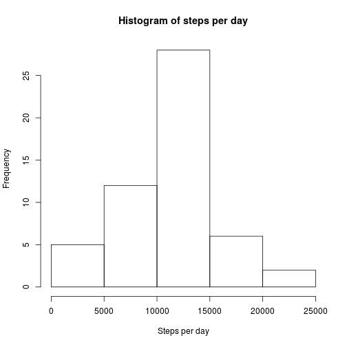
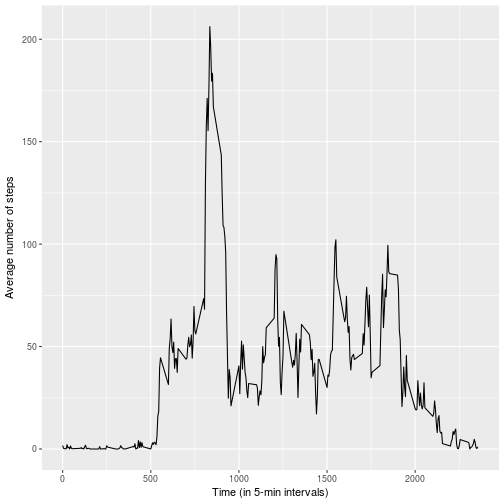
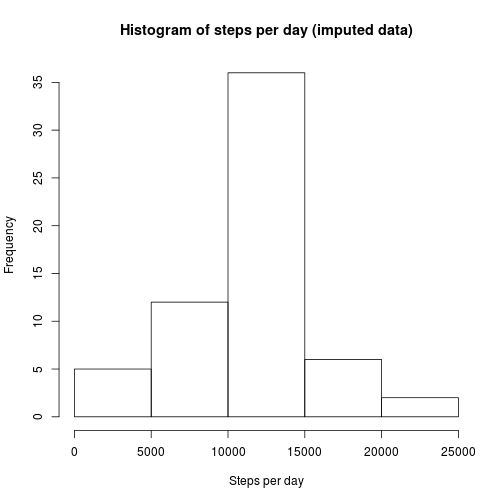
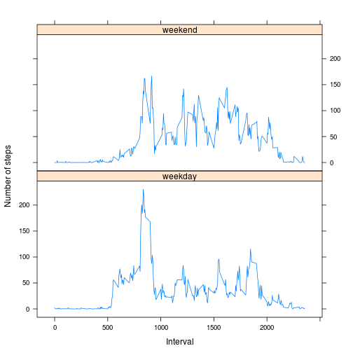

## Loading and preprocessing the data
  
First, we load the data contained in the CSV file.


```r
activity_data <- read.csv(file = "./activity.csv", 
                     header = TRUE, 
                     sep = ",", 
                     stringsAsFactors = FALSE)
```

It is necessary to transform the *date* variable into class **Date**.


```r
activity_data$date <- as.Date(activity_data$date, "%Y-%m-%d")
```

We take a look into the data. 


```r
head(activity_data)
```

```
##   steps       date interval
## 1    NA 2012-10-01        0
## 2    NA 2012-10-01        5
## 3    NA 2012-10-01       10
## 4    NA 2012-10-01       15
## 5    NA 2012-10-01       20
## 6    NA 2012-10-01       25
```

```r
summary(activity_data)
```

```
##      steps             date               interval     
##  Min.   :  0.00   Min.   :2012-10-01   Min.   :   0.0  
##  1st Qu.:  0.00   1st Qu.:2012-10-16   1st Qu.: 588.8  
##  Median :  0.00   Median :2012-10-31   Median :1177.5  
##  Mean   : 37.38   Mean   :2012-10-31   Mean   :1177.5  
##  3rd Qu.: 12.00   3rd Qu.:2012-11-15   3rd Qu.:1766.2  
##  Max.   :806.00   Max.   :2012-11-30   Max.   :2355.0  
##  NA's   :2304
```

We can see that the *steps* variable, which is numeric, has a lot of missing values (coded as "NA"). We will tackle this issue further on.

## What is mean total number of steps taken per day?

We can ignore the issue of the missing values for the time being.

First of all, we calculate the number of steps taken by day. The results are arranged in a table.


```r
table_steps_per_day <- aggregate(steps ~ date, 
                                 activity_data, 
                                 sum, 
                                 rm.na = TRUE)

head(table_steps_per_day)
```

```
##         date steps
## 1 2012-10-02   127
## 2 2012-10-03 11353
## 3 2012-10-04 12117
## 4 2012-10-05 13295
## 5 2012-10-06 15421
## 6 2012-10-07 11016
```

Days with only missing values do not appear in the table.

Now we represent the steps taken by day in the form of histogram.


```r
hist(table_steps_per_day$steps, 
     main = "Histogram of steps per day", 
     xlab = "Steps per day")
```



Also, we calculate the mean and median of the total number of steps taken by day.


```r
# Disable scientific notation
options(scipen = 999)

mean_steps_by_day <- round(mean(table_steps_per_day$steps), 
                           digits = 2)

median_steps_by_day <- round(median(table_steps_per_day$steps), 
                             digits = 2)
```

The mean is 10767.19 and the median is 10766. 


## What is the average daily activity pattern?

First, we need to create a new table with the values we are going to use to represent the time series plot. 


```r
table_time_series <- aggregate(steps ~ interval, 
                               activity_data, 
                               mean, 
                               na.rm = TRUE)
head(table_time_series)
```

```
##   interval     steps
## 1        0 1.7169811
## 2        5 0.3396226
## 3       10 0.1320755
## 4       15 0.1509434
## 5       20 0.0754717
## 6       25 2.0943396
```

Now that we have the mean of steps taken in each interval we can plot the time series.


```r
library(ggplot2)
time_series_plot1 <- ggplot(table_time_series, 
                            aes(x = interval, 
                                y = steps)) +
  geom_line() +
  labs(x = "Time (in 5-min intervals)",
       y = "Average number of steps")
print(time_series_plot1)
```



- *Which 5-minute interval, on average across all the days in the dataset, contains the maximum number of steps?*


```r
interval_max_steps <- table_time_series[which.max(table_time_series$steps), ]
print(interval_max_steps)
```

```
##     interval    steps
## 104      835 206.1698
```


## Imputing missing values

We need to know the total number of missing values in the data set. For this purpose, we sum the number of NA from the *steps* variable in the *activity_data* table.


```r
number_of_NA <- sum(is.na(activity_data$steps))
```

There are 2304 missing values in the data set.

In order to impute the missing values, we calculate the mean of steps per interval and replace the NA with those values. This is done in a new data data frame called *imputed_activity_data*, copied from the original *activity_data* data frame.


```r
imputed_activity_data <- activity_data
```

Remember that we have already calculated the mean of steps per interval. This information is stored in the *table_time_series* data frame. With the following function we can retrieve the mean of steps for a given interval.


```r
get_mean_steps_per_interval <- function(interval) {
    table_time_series[table_time_series$interval == interval, ]$steps
}
```

Finally, we run this function through the new data frame and substitute the NA values with the mean of steps per interval.


```r
for (i in 1:nrow(imputed_activity_data)) {
    if (is.na(imputed_activity_data[i, ]$steps)) {
        imputed_activity_data[i, ]$steps <- get_mean_steps_per_interval(imputed_activity_data[i, ]$interval)
    }
}
```

If we take a look into this new data frame with the NA values imputed...


```r
head(imputed_activity_data)
```

```
##       steps       date interval
## 1 1.7169811 2012-10-01        0
## 2 0.3396226 2012-10-01        5
## 3 0.1320755 2012-10-01       10
## 4 0.1509434 2012-10-01       15
## 5 0.0754717 2012-10-01       20
## 6 2.0943396 2012-10-01       25
```

```r
summary(imputed_activity_data)
```

```
##      steps             date               interval     
##  Min.   :  0.00   Min.   :2012-10-01   Min.   :   0.0  
##  1st Qu.:  0.00   1st Qu.:2012-10-16   1st Qu.: 588.8  
##  Median :  0.00   Median :2012-10-31   Median :1177.5  
##  Mean   : 37.38   Mean   :2012-10-31   Mean   :1177.5  
##  3rd Qu.: 27.00   3rd Qu.:2012-11-15   3rd Qu.:1766.2  
##  Max.   :806.00   Max.   :2012-11-30   Max.   :2355.0
```

... we can see that there are no NA values. 

Subsequently, we make a histogram of the total number of steps taken each day.


```r
table_imputed_steps_per_day <- aggregate(steps ~ date, 
                                  imputed_activity_data, 
                                  sum)

hist(table_imputed_steps_per_day$steps, 
     main = "Histogram of steps per day (imputed data)", 
     xlab = "Steps per day")
```



Then, we calculate and report the mean and median total number of steps taken per day. 


```r
# Disable scientific notation
options(scipen = 999)

imputed_mean_steps_by_day <- round(mean(table_imputed_steps_per_day$steps), 
                                   digits = 2)

imputed_median_steps_by_day <- round(median(table_imputed_steps_per_day$steps), 
                                     digits = 2)
```

The mean is 10766.19 and the median is 10766.19. 

And we answer the following questions: 

- *Do these values differ from the estimates from the first part of the assignment?*

Remember that the mean and median for the data with NA values are 10767.19 and 10766, respectively. Comparing these with the mean and median above, we can see that these are practically the same.

- *What is the impact of imputing missing data on the estimates of the total daily number of steps?*

The impact is minimal. Despite imputing 2304 observations, the mean and median don't change very much, and neither does the histogram of the total of steps taken by day.


## Are there differences in activity patterns between weekdays and weekends?

In this part, we need to create a new factor variable in the *imputed_activity_data* data frame with two levels – “weekday” and “weekend” indicating whether a given date is a weekday or weekend day.


```r
# Set aspects of the locale for the R process.
Sys.setlocale("LC_ALL", 
              "en_US.UTF8")
```

```
## [1] "LC_CTYPE=en_US.UTF8;LC_NUMERIC=C;LC_TIME=en_US.UTF8;LC_COLLATE=en_US.UTF8;LC_MONETARY=en_US.UTF8;LC_MESSAGES=es_ES.UTF-8;LC_PAPER=es_ES.UTF-8;LC_NAME=C;LC_ADDRESS=C;LC_TELEPHONE=C;LC_MEASUREMENT=es_ES.UTF-8;LC_IDENTIFICATION=C"
```

```r
# Temporary variable.
tmp_weekdays <- weekdays(imputed_activity_data$date) 

# Array storing the info about the type of day (weekday or weekend day).
factor_weekday <- array()

# Assign value to the "factor_weekday" variable according to the type of day (weekday or weekend day).
for (day in tmp_weekdays) {
  if (day == "Monday" |
      day == "Tuesday" |
      day == "Wednesday" |
      day == "Thursday" |
      day == "Friday") {
    factor_weekday <- c(factor_weekday, "weekday")
  } else if (day == "Saturday" |
        day == "Sunday") {
    factor_weekday <- c(factor_weekday,"weekend")
  }
}

# Remove tmp_weekdays.
rm(tmp_weekdays)

# Erase first element from the vector (which for no reason is NA).
factor_weekday <- factor_weekday[-1]

# Convert array into factor.
factor_weekday <- as.factor(factor_weekday)

# Add the "factor_weekday" variable to the data frame as a new column.
weekdays_activity_data <- cbind(imputed_activity_data, 
                                factor_weekday)

# Set the "date" variable to Date class.
weekdays_activity_data$date <- as.Date(weekdays_activity_data$date, "%Y-%m-%d")
```

Finally, we make a panel plot containing a time series plot of the 5-min interval (x-axis) and the average number of steps taken, averaged across all weekday days or weekend days (y-axis). 

First, we have to calculate the average of steps taken per 5-min interval for weekdays and weekend days. 


```r
table_week_steps_by_day <- aggregate(weekdays_activity_data$steps ~ weekdays_activity_data$interval + weekdays_activity_data$factor_weekday, 
                                     weekdays_activity_data, 
                                     mean)

names(table_week_steps_by_day) <- c("interval", "factor_weekday", "steps")
```

And then we represent the data in a time series plot.


```r
library("lattice")
xyplot(steps ~ interval | factor_weekday, 
       table_week_steps_by_day, 
       type = "l", 
       layout = c(1, 2), 
       xlab = "Interval", 
       ylab = "Number of steps")
```


